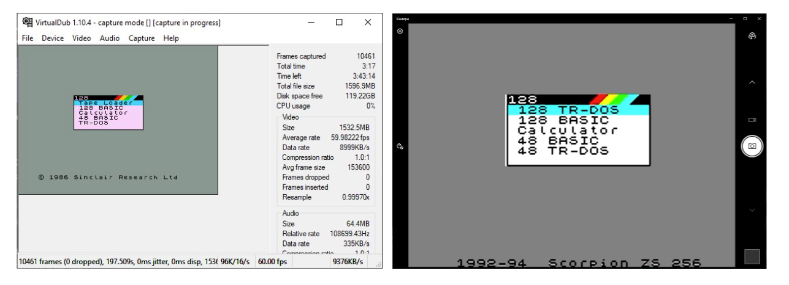

# ZX UVC

Проект устройства для видео захвата экрана спектрум совместимых клонов.

RGB -> DCMI -> STM32H7 -> USB UVC

### Поддерживаемые машины ###

* ZX Pentagon

### Реализовано ###

* UVC 320x240/256x192  
* RGB555@50FPS - В OBS не поддерживается.
* RGB888@20FPS - Поддерживается в OBS

### Не реализовано ###

* Переключение таймингов на лету.
* ZS Scorpion
* RGBI -> cpld -> rgb565

